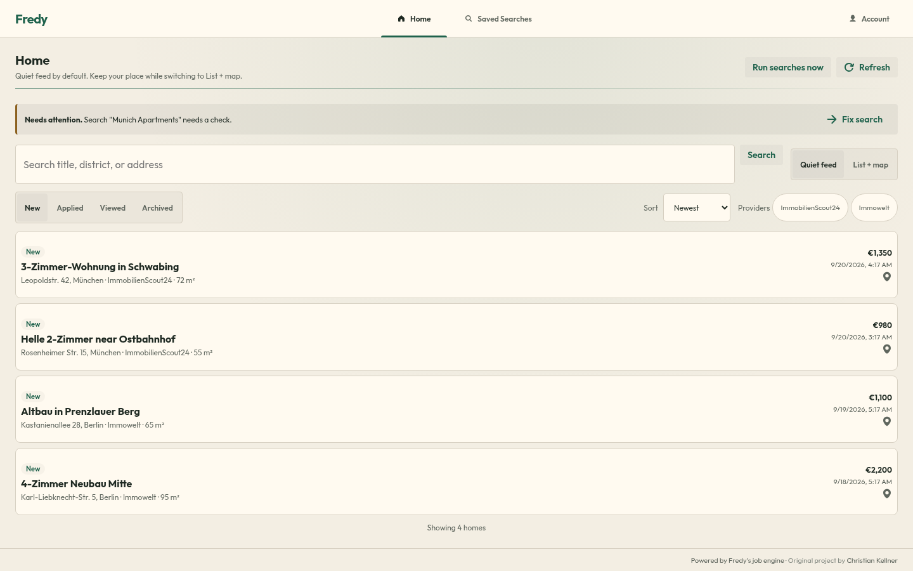
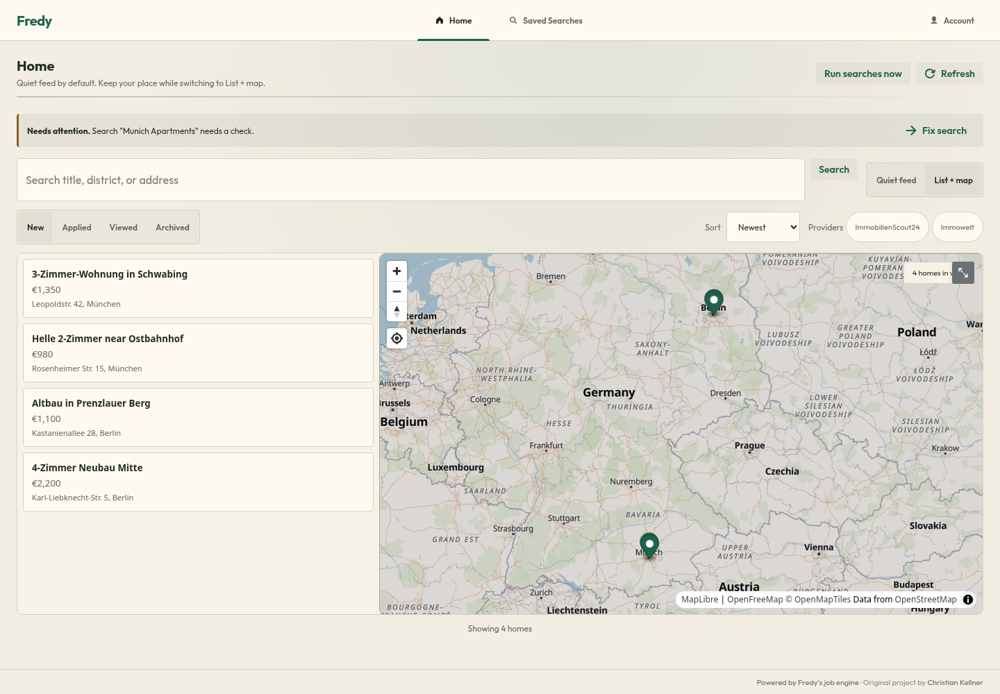
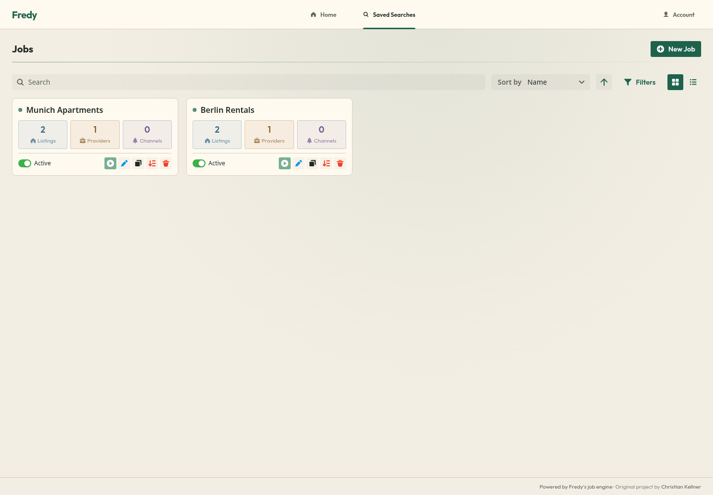
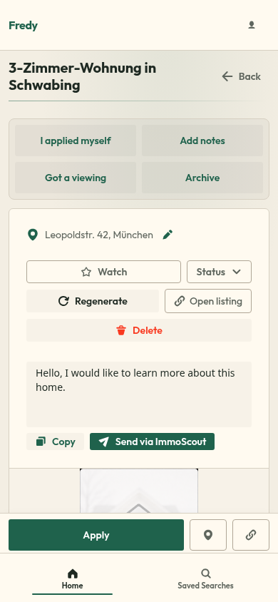
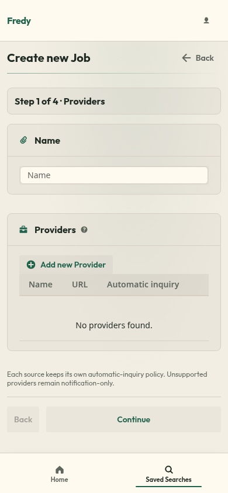
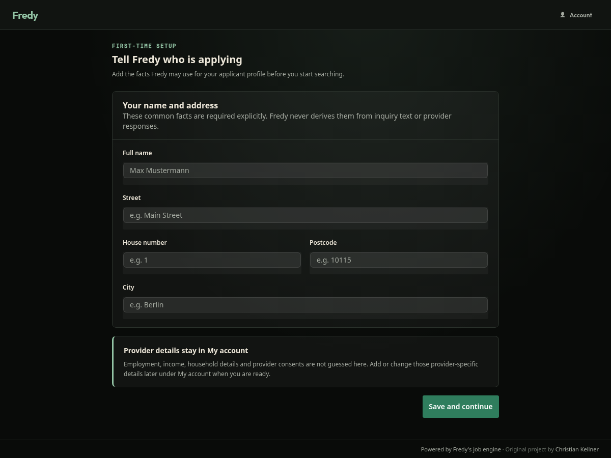

# Fredy

## Find a home that fits your life

[Fredy](https://adhi1419.github.io/fredy/) brings real-estate listings from multiple providers into one focused workspace. Create saved searches, receive new matches through the channels you already use, compare homes by price and size, and check whether a listing fits your commute and daily life.

**[Open Fredy](https://adhi1419.github.io/fredy/)**

Fredy was created by **Christian Kellner**. This fork keeps the original Fredy attribution and source-available license conditions. Read the [license](LICENSE) before redistributing or building a commercial service around Fredy.

## See Fredy in action

Fredy keeps the important choices visible without making the home search feel busy. The same workspace adapts from a quiet desktop feed to a one-handed mobile flow.

  
   
  <em>Home starts with a quiet feed for scanning new matches.</em>

  
   
  <em>List + map adds location context when geography matters.</em>

  
   
  <em>Saved Searches keeps the searches that supply Home easy to manage.</em>

  
  
   
  <em>Mobile layouts keep listing actions and the four-step search setup within easy reach.</em>

  
   
  <em>First-time setup asks explicitly for only the common profile facts Fredy needs.</em>

## What Fredy does

- Searches 19 real-estate providers across Germany, Austria, and Switzerland.
- Removes duplicate listings found on multiple providers.
- Filters listings by home criteria, location, price, size, rooms, and real-world fit.
- Shows travel time, distance, and map context for each home when the required data is available.
- Delivers new listings through configurable notification channels.
- Tracks what you have done with a listing, including applications, viewings, notes, and archiving.
- Supports light and dark themes with responsive, accessibility-reviewed interfaces.

## Start with the live app

Fredy is available at [adhi1419.github.io/fredy](https://adhi1419.github.io/fredy/). Its backend is API-only and runs at [fredy-vh63vbsl2q-ew.a.run.app](https://fredy-vh63vbsl2q-ew.a.run.app). The app uses Firestore as its only persistence layer.

Access is operator-allowlisted. Sign-in uses Google through direct Firebase bearer authentication. An account must be approved for this Fredy instance before it can use the app.

On your first registration, Fredy asks you to enter these common profile facts explicitly:

- Full name
- Street
- House number
- Postcode
- City

Fredy does not infer your employment, income, household details, address, provider credentials, or consent. Provider-specific information is entered separately and only when you choose to use a feature that needs it.

## Two places to work

Fredy has exactly two primary destinations:

- **Home** is your listing feed. It is designed for quick, quiet review.
- **Saved Searches** is where you create and manage the searches that supply Home.

### Home

Home opens to **Quiet feed**, which keeps the listing stream easy to scan. Switch to **List + map** when location matters. Your selected view and feed state are preserved while you move between them.

Home separates listing activity into exclusive states:

- **New**
- **Applied**
- **Viewed**
- **Archived**

You can select multiple providers and sort by:

- Newest
- Travel time
- Distance
- Price
- Size

Open a listing to see its details, map location, provider source, travel information, and your own actions.

### Saved Searches

Creating a saved search takes four steps:

1. **Providers**. Choose the sources and their search criteria. Each provider source keeps its own application policy.
2. **Home criteria**. Set the place, renting or buying choice, price, rooms, size, and other supported criteria.
3. **Real-world fit**. Add commute limits and affordability information that help identify homes you can live with, not only homes that match a portal filter.
4. **Delivery/review**. Choose notification channels, review the search, and save it.

Fredy then checks the selected providers on the instance schedule and brings new matches to Home.

Affordability results are estimates, not financial advice. Verify taxes, purchase costs, interest rates, and any financing decision with the appropriate professionals.

## Listing actions and applications

On mobile, the primary listing actions appear in this order:

1. **Apply**
2. **Google Maps**
3. **Provider listing**

The listing action menu also includes **I applied myself**, **Add notes**, **Got a viewing**, and **Archive**. When Fredy submits an application, the listing becomes **Applied** and any submitted message is available from the listing.

Application support belongs to each provider source. Fredy can submit applications only where the selected provider, listing, and your profile meet that provider's requirements. Automatic application submission is opt-in per provider source in a saved search. It is never a promise that every matching listing will receive an application.

Current provider-submitted application paths include:

- **ImmoScout24**, with provider validation before a supported submission.
- **Deutsche Wohnen**, with the provider-specific contact and income information it requires.
- **HOWOGE offers surfaced through InBerlinWohnen**, which require the provider's confirmation email after Fredy submits the request.

Other providers remain notification-only for provider-submitted applications. You can always open the provider listing and record **I applied myself**.

## Privacy and account expectations

Fredy stores account, search, listing, profile, and activity data in Firestore for this instance. The operator controls who can sign in through the allowlist. Authentication uses a Firebase identity in your browser and a bearer token for protected app requests. Fredy does not create a separate password account or server-side browser session.

Fredy sends information to a provider only when you use a provider feature that requires it and the applicable consent and eligibility checks pass. Application profile fields and provider credentials are not guessed or silently completed. Review provider requirements before enabling automatic application submission.

## Providers

Fredy currently supports these sources:

**Germany:** 1a Immobilien, Deutsche Wohnen, Engel & Völkers, IMAXX, Immobilien.de, Immo Südwest Presse, ImmoScout24, Immowelt, InBerlinWohnen, Kleinanzeigen, McMakler, Neubau Kompass, OhneMakler, Regionalimmobilien24, Schwarzes Brett Bremen, Sparkasse Immobilien, and Wg gesucht.

**Austria:** willhaben.

**Switzerland:** Flatfox.

Provider coverage and supported search fields can differ by source because each provider supplies its own listings and search interface. Fredy shows the provider attached to every listing.

## Notifications

Create a notification channel once and reuse it across saved searches. Current customer-facing delivery options include:

- Slack and Slack with Webhooks
- Telegram
- Discord Webhook
- Mattermost
- ntfy
- Pushover
- Browser Notifications
- Apprise
- Generic HTTP POST
- Email through SMTP, SendGrid, MailJet, or Resend

Each channel stores the destination and credentials needed by that service. You control which channels receive each saved search.

## Credits and data

Travel planning and transit data come from [Transitous](https://transitous.org/), a community-run [MOTIS](https://github.com/motis-project/motis) instance. Map and street data come from [OpenStreetMap](https://www.openstreetmap.org/copyright) contributors. Please respect the [Transitous usage policy](https://transitous.org/api/).

## Attribution and license

Fredy is the original project of **Christian Kellner**. This fork must retain clear attribution to the original project and author.

Fredy is licensed under Apache-2.0 with two additional conditions. It is **source-available, not OSI open source**.

### Commons Clause

The Licensed Work and its derivative works may not be used by any person or organization to Sell the Licensed Work.

“Sell” or “Selling” means practicing any or all of the rights granted to you under the License to provide to third parties, for a fee or other consideration (including without limitation fees for hosting or consulting/support services related to the Software), a product or service whose value derives, entirely or substantially, from the functionality of the Licensed Work.

This restriction does not apply to internal business purposes or non-commercial use. Self-hosting Fredy for yourself is permitted. Read the full [LICENSE](LICENSE) for the complete terms.

### Attribution and Naming Clause

Any derivative work based on this software must include clear and visible attribution to the original project “Fredy” and its author(s). Derivative works may not be distributed, published, or presented under a different name or branding without the explicit written permission of the original copyright holder.

## Support

For bugs and feature requests, use the [Fredy fork issue tracker](https://github.com/adhi1419/fredy/issues). When reporting a problem, include the provider, saved-search context, and the steps that reproduce it. Do not include passwords, provider credentials, or other private information.

Developers and operators can find setup, deployment, validation, recovery, and extension guidance in the [Developer and Operator Guide](docs/DEVELOPER_OPERATOR_GUIDE.md).
